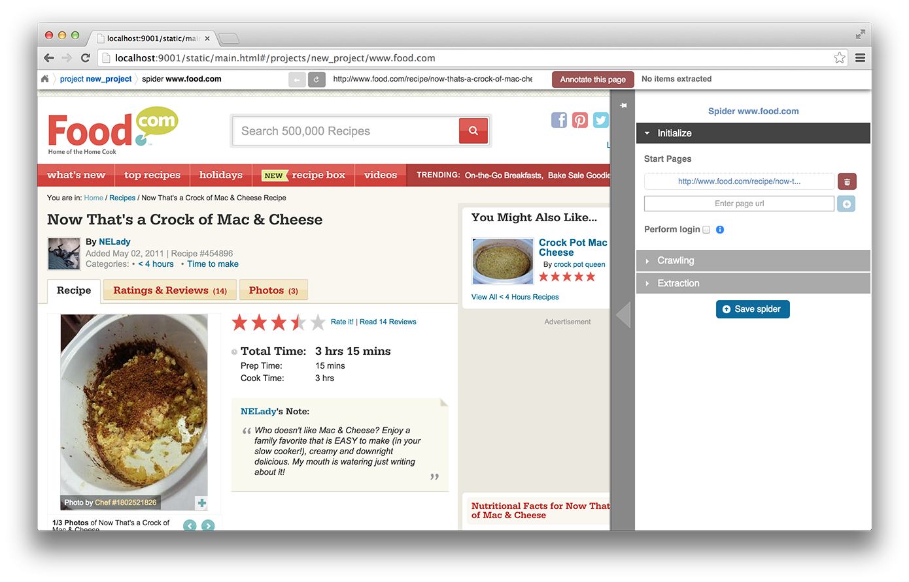

.. _portia:

======
Portia
======

Portia is a tool that allows you to visually scrape websites without any programming knowledge required. With Portia you can annotate a web page to identify the data you wish to extract, and Portia will understand based on these annotations how to scrape data from similar pages. 

.. _anatomy:

Anatomy of a Portia Project
===========================

A project in Portia generally consisits of one or more spiders.

Spider
------

A spider is a crawler for a particular website. The configuration of a spider is split into three sections: 
   
    * **Initialize**
    * **Crawling**
    * **Extraction**

.. TODO: Add cropped annotated screenshot describing Initialize settings here

The **Initialize** section is used to set up the spider when it's first launched. The start pages are the first URLs the spider will visit to begin crawling. There is also the ability to set login credentials if the website you're crawling requires authentication.

.. TODO: Add cropped annotated screenshot describing Crawling settings here

The **Crawling** section is used to configure how the spider will behave when encountering a new URL. There are three main options to choose from:

    * **Follow all in-domain links** - follow any links that match the website's domain.
    * **Don't follow links** - don't follow any links: use this if you're only extracting data from your start pages.
    * **Configure follow and exclude patterns** - when selected you will be able to define which links to follow and which to exclude based on regular expressions.

Other settings include:

    * **Respect nofollow** - if this is checked then the spider won't follow any links whose ``rel`` attribute is set to ``nofollow``.
    * **Overlay blocked links** - if this is enabled the crawler will highlight followed links in green and non-followed links in red.

The **Extraction** section lists the templates for this spider.

Templates
---------

Templates are used by Portia to describe what data on a page should be extracted into an item. Templates exist within the context of a spider and are made up of annotations which define the elements you wish to extract from a page. Within the template you define the item you want to extract as well as mark any fields that are required for that item. 

.. TODO: Add screenshot of extractors here

You can also add extractors to item fields. Extractors allow you to further refine information extracted from a page using either regexes or a predefined type. For example, let's say there's an element on the page that contains a phone number, but it also contains some other text that you don't need. You could use a regular expression that matches phone numbers and add it as an extractor to the relevant field; upon extracting that field only the phone number would be stored. 

Annotations
-----------

.. TODO: Add screenshot of annotation being made here

An annotation defines the location of a piece of data on the web page and how it should be used by the spider. Typically an annotation maps some element on the page to a particular field of an item, but there is also the option to mark the data as being required without storing the data in an item. It's possible to map attributes of a particular element instead of the content if this is required, for example you can map the ``href`` attribute of an anchor link rather than the text.

Items
-----

.. TODO: Add screenshot of item editor

An item refers to a single item of data scraped from the target website. A common example of an item would be a product for sale on an e-commerce website. An item consists of multiple fields, so using the example of a product you might have fields named ``name``, ``price``, ``manufacturer`` and so on. Annotations are used to extract data from the page into each of these fields.

There are two flags that can be enabled on a field: **Required** and **Vary**. If a field marked as **Required** is missing then the item will be discarded. If a field is marked as **Vary**, then that field will be ignored when checking duplicates. In other words, if an item is scraped and all of its fields match those of a previously scraped item with the exception of one field that is marked as **Vary**, then this item will be considered a duplicate.

Creating a Portia Project
=========================

To create a new project, begin by entering the site's URL in the navigation bar at the top of the page and clicking ``Start``. It's easiest to start with the URL of an item you would want to extract, that way you don't have to navigate to a page containing the item you want to extract. Clicking ``Start`` should create a new project along with a spider for the website, and you should see the loaded web page:

.. TODO: Add screenshot of loaded web page

On the right you have the ability to configure the spider. The start pages are the URLs first visited by the spider when beginning a new crawl, and you can configure the spiders link following behaviour under crawling. By default, the first start URL will be set to the URL you entered when creating the project, so you may want to change this to the site's home page. To begin defining the data you want to extract, click the red button labelled ``Annotate this page`` at the top of the screen. 

.. TODO: Add screenshot of annotation screen

You will now be able to highlight and click elements on the web page that you wish to extract. When you click an item, a context menu appears allowing you to map an attribute or the element's content to a particular field. You'll notice in the field drop down that there is a ``-just required-`` option. When this option is chosen this will indicate that for an item on the page to exist, that element must exist. It's important to note that the content within the element can vary; only the existence of the element will be taken into account. Another option is ``-create new-`` which allows you to create a new field for the extracted item if necessary.

You can then mark any fields that are required by going into the item editor under ``Extracted item``. You can also tick ``Vary`` to exclude the field from being used to detect duplicate items.

Annotating a Template
=====================

It's possible to extract multiple fields using a single annotation if there are several properties you want to extract from an element. For example, if there was an anchor link on the page, you could map the ``href`` attribute containing the URL to one field, and you could map the link's text to another. You can view a particular annotation's settings by either clicking the cog in the annotation pop-up window or by clicking the cog beside the annotation in the ``Annotations`` section of the template configuration. Within this context there is an ``Attribute mappings`` section where you can define additional mappings for the selected annotation should you want to map other attributes.

Running Portia Locally
======================

Prerequisites
-------------

Installation
------------

Checkout the repository::

    git clone https://github.com/scrapinghub/portia

Ideally, you should create an environment with virtualenv::

    virtualenv YOUR_ENV_NAME --no-site-packages
    source YOUR_ENV_NAME/bin/activate

Install the required packages::

    cd slyd
    pip install -r requirements.txt

Running Portia
--------------

Start slyd::

    cd slyd
    twistd -n slyd

Portia will now be running on port 9001 and you can access it at: ``http://localhost:9001/static/main.html``

Running Portia with Vagrant
---------------------------

You will need both `Vagrant <http://www.vagrantup.com/downloads.html>`_ and `VirtualBox <https://www.virtualbox.org/wiki/Downloads>`_ installed.

Run the following in Portia's directory::

    vagrant up

This will launch a Ubuntu virtual machine, build Portia and start the ``slyd`` server. You'll then be able to access Portia at ``http://localhost:9001/static/main.html``. You can stop the ``slyd`` server using ``vagrant suspend`` or ``vagrant halt``. To run ``portiacrawl`` you will need to SSH into the virtual machine by running ``vagrant ssh``.

Running a Portia Spider
-----------------------

Projects you have created in Portia will reside in ``slyd/data/projects``. You can use ``portiacrawl`` to run a spider from one of your projects::

    portiacrawl PROEJCT_PATH SPIDER_NAME

where ``PROJECT_PATH`` is the path of the project and ``SPIDER_NAME`` is a spider that exists within that project. You can list the spiders for a project with the following::

    portiacrawl PROJECT_PATH

Portia spiders are ultimately `Scrapy <http://scrapy.org/>`_ spiders. You can pass Scrapy arguments when running with ``portiacrawl`` using the ``-a`` option. You can also specify a custom settings module using the ``--settings`` option. The `Scrapy documentation <http://doc.scrapy.org/en/latest>`_ contains full details on available options and settings.

Deploying a Project
===================

Portia projects can be deployed using `Scrapyd <http://scrapyd.readthedocs.org/en/latest>`_. You can deploy a Portia project by going into ``slyd/data/projects/PROJECT_NAME``  and running the following::

    scrapy-deploy SCRAPY_TARGET -p PROJECT_NAME

Advanced Concepts
=================

Variants
--------

Variants are useful if there are multiple variations of each item you're scraping. By default, annotations use the ``Base`` variant which refers to the base item. If all annotations are assigned to the base item, only a single item will be generated upon extraction. This is the most common scenario, but consider the following:

You are wanting to scrape an e-commerce website that sells beds, and some beds come in multiple sizes e.g. ``Single``, ``Double``, ``Queen``, ``King``. The product page for each bed has a table of prices for each size, like so:

+---------+------+
| Single  | $300 |
+---------+------+
| Double  | $500 |
+---------+------+
|  Queen  | $650 |
+---------+------+
|  King   | $800 |
+---------+------+

The rest of the data you want to extract (product name, description etc.) is common across all sizes. In this case, you would annotate the common data to the base item and create the fields ``size`` and ``price``. You would then annotate the ``Single`` cell as variant 1 of ``size``, and the ``$300`` cell as variant 1 of ``price``, followed by annotating ``Double`` as variant 2 of ``size``, ``$500`` as variant 2 of ``price`` and so on. It's worth noting that in this case, it wouldn't be necessary to create a variant for each row; usually it is enough to annotate only the first and last row of the table as Portia will automatically create variants for rows in between.

Partial Annotations
-------------------

.. TODO: Screenshot of partial annotations

Partial annotations can be used to extract some part of text which exists as part of a common pattern. For example, if an element contained the text ``Price: $5.00``, you could highlight the ``5.00`` part and map it to a field. The ``Price: $`` part would be matched but removed before extracting the field. In order to create a partial annotation, all you need to do is highlight the text the way you would normally, by clicking and dragging the mouse. The annotation window will pop up and you will be able to map it to a field the same way you would with a normal annotation.

There are some limitations to partial annotations. As mentioned in the previous paragraph, the text must be part of a pattern. For example, let's say an element contains the following text::

    Veris in temporibus sub Aprilis idibus habuit concilium Romarici montium

One of the pages visited by the crawler contains the following text in the same element::

    Cui dono lepidum novum libellum arido modo pumice expolitum?

If you had annotated ``Aprilis`` in the template, nothing would have matched because the surrounding text differs from the content being matched against. However, if the following text had instead appeared in the same element::

    Veris in temporibus sub Januarii idibus habuit concilium Romarici montium

The word ``Januarii`` would have been extracted, because its surrounding text matches the text surrounding the text that was annotated in the template.

Working with Multiple Templates
-------------------------------

The more annotations a template has, the more specific the data being extracted and therefore less chance of a false positive. For this reason, templates with more annotations take precedence over those with less annotations. If a subset of templates contains equal number of annotations per template, then within that subset templates will be tried in the order they were created from first to last. In other words, templates are tried sequentially in order of number of annotations first, and age second.

You may need to use more than one template even if you're only extracting a single item type. For example, an e-commerce site may have a different layout for books than it does for audio CDs, so you would need to create a template for each layout.

Scenarios
---------

